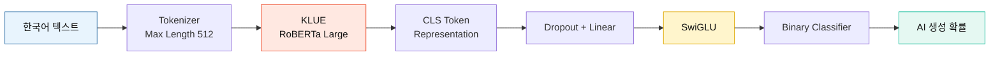

<h1 align="center">🤖 2025 Hallym AI Text Detection</h1>
<h3 align="center">2025학년도 한림대학교 디지털 경진대회 은상 수상작</h3>
<p align="center"><strong>KLUE RoBERTa를 활용한 한국어 AI 생성 텍스트 탐지</strong></p>

<p align="center">


</p>

<p align="center">


</p>

---

## 🎯 Project Overview

주어진 한국어 텍스트가 **사람이 작성한 글인지, AI가 생성한 글인지**를 판별하는 이진 분류 프로젝트입니다. `klue/roberta-large`를 파인튜닝하고 Stratified 5-Fold 교차 검증과 예측 앙상블을 적용했습니다.

| 🏆 Award | 🎯 Task | 📊 Metric | 🧠 Backbone |
|:---:|:---:|:---:|:---:|
| **은상** | Binary Text Classification | F1-score | KLUE RoBERTa Large |

### Competition

| Item | Details |
|---|---|
| 대회명 | 2025학년도 한림대학교 디지털 경진대회 |
| 주최 | 한림대학교 SW중심대학사업단 |
| 대회 기간 | 2025.05.13 ~ 2025.05.26 |
| 평가 지표 | F1-score |
| 수상 | **은상** |

### Labels

| Label | Meaning |
|:---:|---|
| `0` | 👤 사람이 작성한 텍스트 |
| `1` | 🤖 AI가 생성한 텍스트 |

---

## ⚙️ Model Pipeline



### Training Strategy

| Component | Configuration |
|---|---|
| Text encoder | `klue/roberta-large` |
| Classification head | Dropout → Linear → SwiGLU → Dropout → Linear |
| Input | CLS token representation |
| Maximum sequence length | 512 |
| Batch size | 8 |
| Epochs | 5 |
| Optimizer | AdamW |
| Learning rate | `2e-5` |
| Loss | BCEWithLogitsLoss |
| Validation | Stratified 5-Fold |
| Validation metric | Macro F1-score |

---

## 📈 Validation Results

| Fold | Macro F1-score |
|:---:|---:|
| 1 | 0.9634 |
| 2 | 0.9940 |
| 3 | 0.9756 |
| 4 | 0.9622 |
| **5** | **1.0000** 🎯 |
| **5-Fold Mean** | **0.9790 ± 0.0155** |

> [!NOTE]
> **Best Fold Macro F1-score 1.0000**을 기록했습니다. 전체 5-Fold 평균은 **0.9790 ± 0.0155**이며, 위 수치는 대회 당시 실행한 노트북에 저장된 교차 검증 결과입니다.

---

## 🗂️ Repository

| File | Description |
|---|---|
| [**`hallym_ai_text_detection.ipynb`**](./hallym_ai_text_detection.ipynb) | 데이터 전처리, 모델 학습, 교차 검증, 예측 및 제출 파일 생성 |
| [**`result.csv`**](./result.csv) | 대회 최종 예측 결과 |
| [**`requirements.txt`**](./requirements.txt) | Python 패키지 의존성 |

### Final Result

`result.csv`는 대회 최종 제출 파일을 GitHub 공개용 이름으로 정리한 것입니다. 500개 테스트 텍스트의 예측을 `id,label` 형식으로 저장합니다.

| Predicted label | Count | Ratio |
|:---:|---:|---:|
| `0` Human | 400 | 80% |
| `1` AI | 100 | 20% |

---

## 🚀 Getting Started

대회 당시 노트북은 **Python 3.11.11**, **PyTorch 2.6.0**, **PyTorch Lightning 2.5.1** 환경에서 실행했습니다.

```bash
git clone https://github.com/yeosan3131/Kaggle-Challenges/tree/main/Generative-AI-Text-Detection
cd 2025-hallym-ai-text-detection
pip install -r requirements.txt
jupyter lab hallym_ai_text_detection.ipynb
```

> [!IMPORTANT]
> 학습과 테스트에 사용된 대회 제공 데이터는 이 저장소에 포함되지 않습니다.

---

<p align="center"><strong>2025 Hallym Digital Competition · Silver Award</strong></p>
